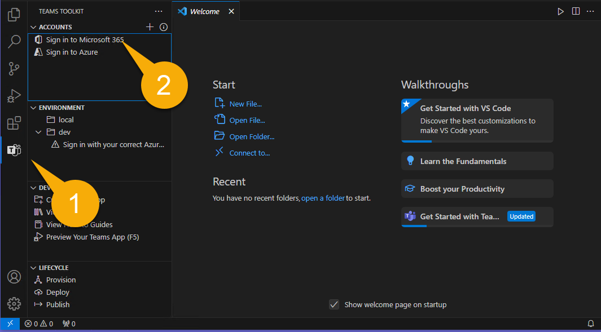

## Exercise 1: Run the starting solution

### Step 1: Open the solution in Visual Studio Code with Teams Toolkit

1. Open **Visual Studio Code**
1. Expand the **File** menu, select **Open folder...**
1. Navigate to **C:\Users\LabUser\TeamsApps**, select the folder with the name **LAB-445**, and select **Select folder**. Visual Studio Code opens the project in a new window.

Continuing in the new window:

1. On the **Activity Bar**, select the **Teams Toolkit icon** 1️⃣.
1. Under **Accounts**, select **Sign in to Microsoft 365** 2️⃣. A browser window is opened.

Continuing in the web browser:

- Sign in using a "Work and School" account; as a reminder here are your login credentials for the lab tenant:
    - **Username**: +++@lab.CloudPortalCredential(User1).Username+++
    - **Password**: +++@lab.CloudPortalCredential(User1).Password+++

Continuing in Visual Studio Code:

- Ensure that **Custom app upload enabled** and **Copilot access enabled** appear with a green checkbox before continuing.

### Step 2: Set up the local environment files

1. In the **Activity Bar**, select the **Explorer** (top) icon to view the files list.
1. In the env folder, rename **.env.local.user.sample** to **.env.local.user**.

### Step 3: Test the web service

- Start a new debug session, press <kbd>F5</kbd> on your keyboard.

Press F5 or hover over the "local" environment and click the debugger symbol that will be displayed 1️⃣ and then select "debug in Microsft Edge" 2️⃣.

It will take a while. If you get an error about not being able to run the "Ensure database" script, please try a 2nd time as this is a timing issue waiting for the Azure storage emulator to run for the first time.

The Edge browser should open to the Copilot "Bizchat" page.

If you are prompted to log in, choose "work and school" account and use these credentials:

**Username: +++@lab.CloudPortalCredential(User1).Username+++**

**Password: +++@lab.CloudPortalCredential(User1).Password+++**

Minimize the browser so you can test the API locally. (Don't close the browser or you will exit the debug session!)

With the debugger still running 1️⃣, switch to the code view in Visual Studio Code 2️⃣. Open the http folder and select the treyResearchAPI.http file 3️⃣.

Before proceeding, ensure the log file is in view by opening the "Debug console" tab 4️⃣ and ensuring that the console called "Attach to Backend" is selected 5️⃣.

Now click the "Send Request" link in treyResearchAAPI.http just above the link {{base_url}}/me 6️⃣.

You should see the response in the right panel, and a log of the request in the bottom panel. The response shows the information about the logged-in user, but since we haven't implemented authentication as yet (that's coming in Lab 6), the app will return information on the fictitious consultant "Avery Howard". Take a moment to scroll through the response to see details about Avery, including a list of project assignments.

Try some more API calls to familiarize yourself with the API and the data.

### Step 4: Run the solution in Copilot

Now restore the browser window you minimized in Step 3. You should see the Microsoft 365 Copilot window. If you need to navigate there, the URL is +++https://www.microsoft365.com/chat/?auth=2+++.

Open the right flyout 1️⃣ and, if necessary, click "Show more"2️⃣ to reveal all the choices. Then choose "Trey Genie local"3️⃣, which is the agent you just installed.

Try one of the prompt suggestions such as, "Find consultants with TypeScript skills." You should see two consultants, Avery Howard and Sanjay Puranik, with additional details from the database.

Your log file should reflect the request that Copilot made. You might want to try some other prompts, clicking "New Chat" in between to clear the conversation context. Here are some ideas:

 * +++Find consultants who are Azure certified and available immediately+++ (this will cause Copilot to use two query string parameters)
 * +++What projects am I assigned to?+++ (this will return information about Avery Howard who is "me" since we haven't implemented authentication)
 * +++Charge 3 hours to the Woodgrove project+++ (this will cause a POST request, and the user will need to confirm before it will udpate the data)
 * +++How many hours have I billed to Woodgrove+++ (this will demonstrate if the hours were updated in the database)