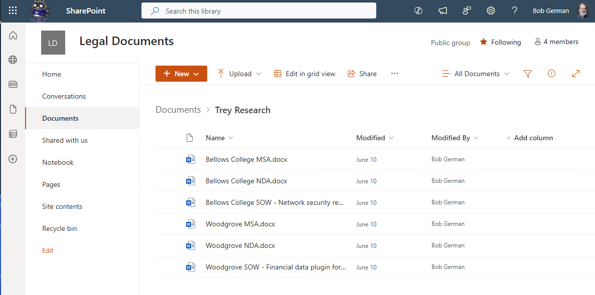

 ## Exercise 2: Add instructions and SharePoint files

 In this exercise you'll update your declarative agent with more instructions and add the capability to include knowledge from a SharePoint site.
 
### Step 1: Add instructions

Open in the **appPackage** folder open **trey-declarative-agent.json**. Add some text to the **instructions** value, staying on one line and between the quotation marks:

~~~
Be sure to remind users of the Trey motto, 'Always be Billing!'.
~~~

### Step 2: Inspect the SharePoint site

In a web browser, open the site +++https://lodsprodmca.sharepoint.com/sites/TreyLegalDocuments+++. You may need to log in again. When you see the site home page, click on "Documents" to view the Trey Research legal documents. Notice that it contains contracts for two consulting engagements, Bellows College and Woodgrove Bank.

### Step 3: Add the SharePoint capability

Now return to the **trey-declarative-agent.json** file and add these lines just above the **actions** property:

~~~
"capabilities": [
    {
        "name": "OneDriveAndSharePoint",
        "items_by_url": [
            {
                "url": "https://lodsprodmca.sharepoint.com/sites/TreyLegalDocuments"
            }
        ]
    }
],
~~~

The final **trey-declarative-agent.json** file should look like this:

~~~
{
    "$schema": "https://aka.ms/json-schemas/copilot-extensions/vNext/declarative-copilot.schema.json",
    "version": "v1.0",
    "name": "Trey Genie Local",
    "description": "You are a handy assistant for consultants at Trey Research, a boutique consultancy specializing in software development and clinical trials. ",
    "instructions": "Greet users in a professional manner, introduce yourself as the Trey Genie, and offer to help them. Your main job is to help consultants with their projects and hours. Using the TreyResearch action, you are able to find consultants based on their names, project assignments, skills, roles, and certifications. You can also find project details based on the project or client name, charge hours on a project, and add a consultant to a project. If a user asks how many hours they have billed, charged, or worked on a project, reword the request to ask how many hours they have delivered. In addition, you may offer general consulting advice. If there is any confusion, encourage users to speak with their Managing Consultant. Avoid giving legal advice. Be sure to remind users of the Trey motto, 'Always be Billing!'.",
    "conversation_starters": [
        {
            "title": "Find consultants",
            "text": "Find consultants with TypeScript skills"
        },
        {
            "title": "My Projects",
            "text": "What projects am I assigned to?"
        },
        {
            "title": "My Hours",
            "text": "How many hours have I delivered on projects this month?"
        }
    ],
    "capabilities": [
        {
            "name": "OneDriveAndSharePoint",
            "items_by_url": [
                {
                    "url": "https://lodsprodmca.sharepoint.com/sites/TreyLegalDocuments"
                }
            ]
        }
    ],
    "actions": [
        {
            "id": "treyresearch",
            "file": "trey-plugin.json"
        }
    ]
}
~~~

NOTE: The completed solution can be found in C:\Users\LabUser\TeamsApps\LAB-445-END on your workstation if you want to copy or compare with the final source code.

#### Step W: Provision a new version of the declarative agent

Let's create a new version of the declarative agent, so we can test the new capabilities.

First, in Visual Studio Code open the **env** folder and delete **.env.local** file. This will force Teams Toolkit to make a new application.

Second, in your **trey-declarative-agent.json** file, add a number to the name such as "Trey Genie 2", as you will see another copy of the agent in Copilot. Then test by clicking on the one with a new name.

### Step 4: Test in Copilot

Now press F5 or the arrow button to start the debugger again. In case BizChat doesn't open, copy the following link in the browser: +++https://www.microsoft365.com/chat/?auth=2+++.

> NOTE: If the debugger does not start after a few minutes, close Visual Studio Code and open it again. There is a race condition when starting the database a second time in the same VS Code session; it is harmless except requring restarting VS Code from time to time.

Find the "Trey Genie 2" in Copilot and test with the prompt below:

* +++"What is the status of the Woodgrove project?"+++ (The project phases should come from the statement of work in SharePoint)

In addition to including information from the statement of work, Copilot should include the Trey motto, "always be billing."